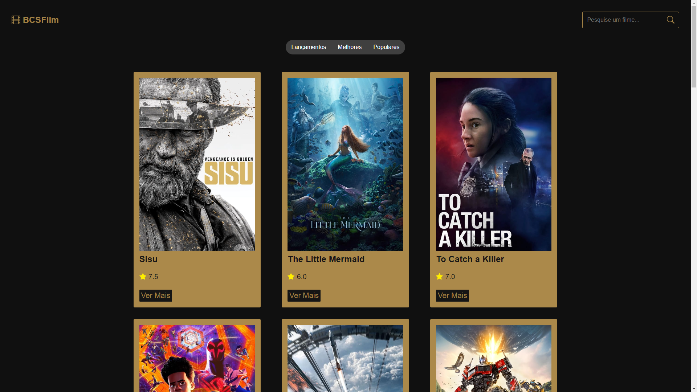
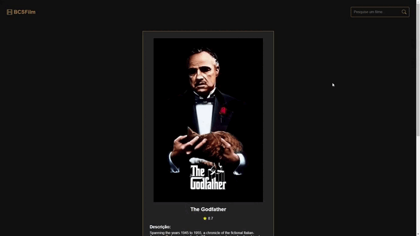

# Visualização do projeto

## Início

 

## Detalhes

 

## Pesquisa

 

# Tecnologias

Utilização da API do TMDB junto ao REACT e o VITE, usufruindo de assuntos como REACT Router, Hooks, dentre outros.

# Sobre

## Detalhes do Projeto
- Página de visualização dos filmes de acordo com a classificação desejada pelo usuário
- Página individual com detalhes sobre os filmes
- Página de busca com os filmes associados a pesquisa do usuário
